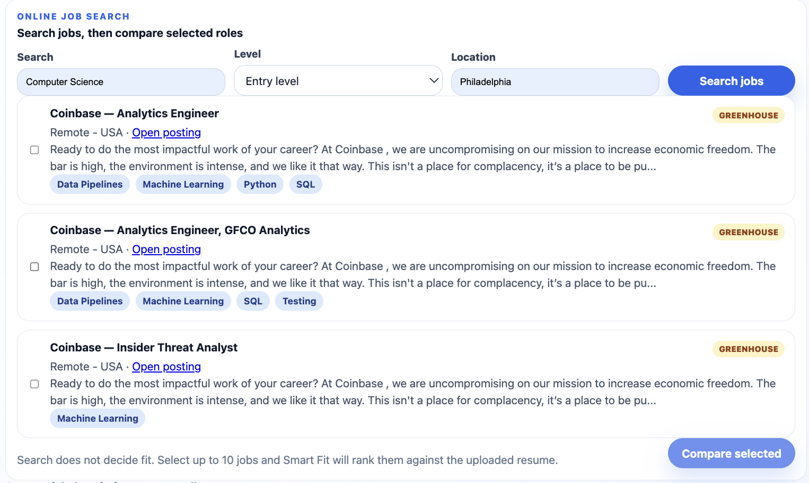
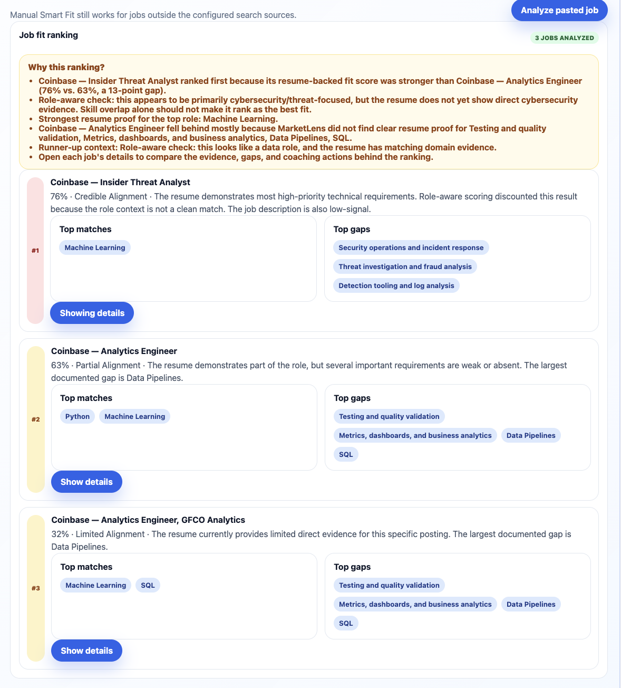
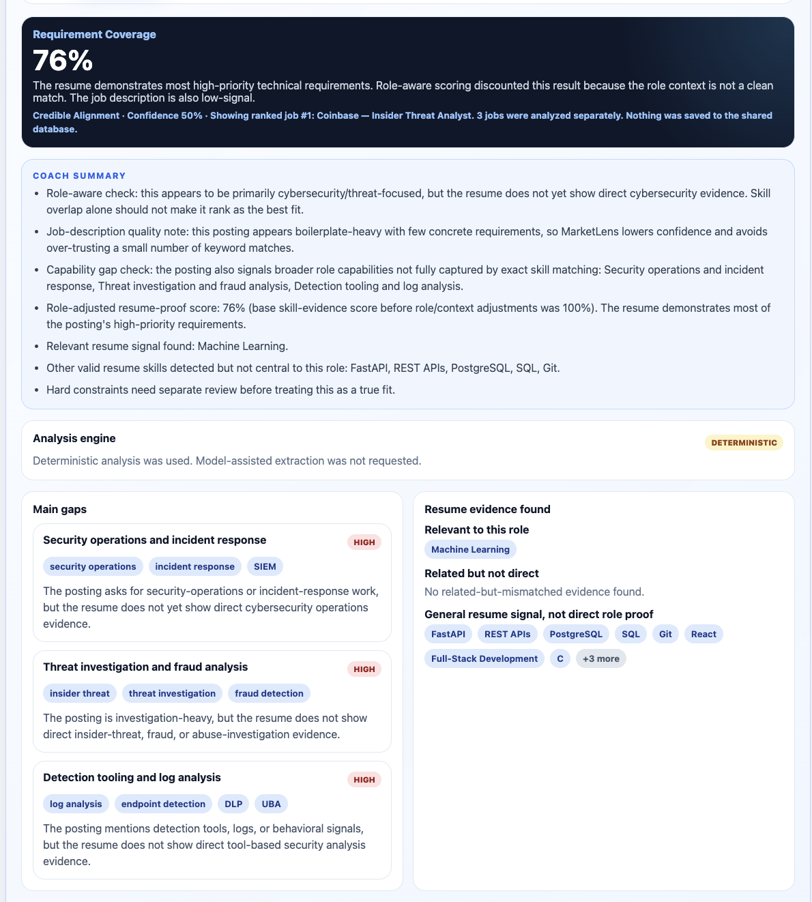
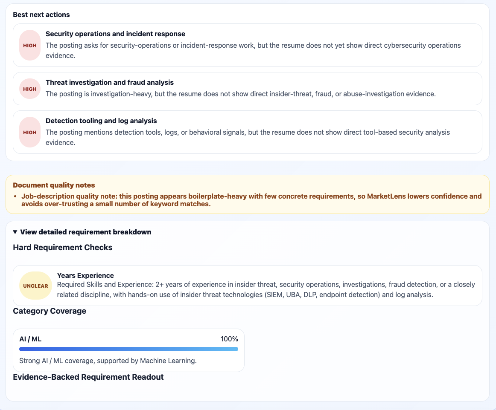

# MarketLens Career Intelligence

MarketLens is a full-stack career intelligence platform that compares resume evidence against real job descriptions, ranks role fit, and turns noisy postings into clearer skill gaps and learning priorities.

## Project Highlights

- **Deployed full-stack app:** React + TypeScript frontend, FastAPI backend, SQLAlchemy persistence, and Railway deployment.
- **Resume-to-job comparison:** Users can upload or paste a resume, search configured public job sources, select jobs, and compare fit.
- **Role-aware Smart Fit:** The app ranks jobs using resume-backed evidence, role-family context, capability gaps, and coaching actions.
- **Online + manual workflows:** Users can search public Greenhouse, Lever, Remote OK, and Remotive sources or paste outside postings manually.
- **Security-conscious demo design:** Public users can analyze non-sensitive text without saving reports, while write/delete endpoints remain admin-protected.
- **Quality coverage:** Backend tests cover API behavior, job search filtering, Smart Fit analysis, role-aware behavior, and evaluation cases.

## Tech Stack

| Area | Tools |
| --- | --- |
| Frontend | React, TypeScript, Vite, CSS |
| Backend | Python, FastAPI, Pydantic, SQLAlchemy |
| Database | SQLite locally, PostgreSQL-ready deployment through `DATABASE_URL` |
| Job sources | Greenhouse Job Board API, Lever Postings API, Remote OK, Remotive |
| Testing / Quality | pytest, frontend production build, GitHub Actions, Dependabot |
| Deployment | Railway frontend, Railway backend, Railway/PostgreSQL-ready backend configuration |

## Resume / Interview Summary

MarketLens is a deployed full-stack career-intelligence app that compares resume evidence against real job postings, ranks job fit, and explains role-specific gaps. I built the React frontend, FastAPI backend, job-search normalization layer, Smart Fit analysis workflow, role-aware scoring logic, security controls, tests, and deployment pipeline.

Resume bullet version:

```text
Built and deployed MarketLens, a full-stack React/FastAPI career-intelligence app that searches public job APIs, compares resumes against multiple postings, ranks role fit, identifies role-specific capability gaps, and explains recommendations with tested backend analysis logic.
```

## Live Demo

- **Frontend app:** [MarketLens live demo](https://marketlens-career-intelligence-production-8a34.up.railway.app)
- **Backend API docs:** [FastAPI Swagger UI](https://marketlens-career-intelligence-production.up.railway.app/docs)
- **Backend health check:** [API health endpoint](https://marketlens-career-intelligence-production.up.railway.app/health)
- **Portfolio demo walkthrough:** [How to demo MarketLens](docs/portfolio-demo-walkthrough.md)

The deployed version is a secured portfolio/demo app. Public visitors can view the saved demo dataset, explore skill dashboards, upload or paste non-sensitive resume text, search configured public job sources, paste job descriptions manually, and run non-saved Smart Fit comparisons. Creating postings, importing CSV files, and deleting saved postings are admin-only actions protected by an `X-Admin-API-Key` header.

Do not upload sensitive personal information, secrets, API keys, database URLs, or confidential employer/customer data.

## Screenshots

### Online job search

MarketLens searches configured public job sources and normalizes postings into selectable cards.



### Ranked Smart Fit comparison

Users can select multiple jobs and compare them against the same resume. The ranking explains score gaps, resume evidence, and runner-up gaps.



### Role-aware gap report

Detailed reports separate direct role evidence from general resume signals and surface capability gaps that exact keyword matching would miss.



### Coaching actions and requirement breakdown

The report prioritizes next actions and keeps hard requirements separate from broader coaching guidance.



## Problem

Career advice is often vague, and job descriptions are noisy. Students and career-switchers are told to “learn cloud,” “build projects,” or “get better at AI,” but it is hard to know which skills are actually showing up in the roles they want or which roles fit their current resume best.

MarketLens turns messy job postings into evidence. Instead of guessing what to learn next, users can compare their resume against real job descriptions, rank roles by fit, and see which missing skills matter most.

## Current Milestone: Role-Aware Smart Fit Comparison

MarketLens now includes a role-aware Smart Fit comparison workflow. Users can compare multiple job postings against a resume, see why one role ranked above another, and review role-specific capability gaps rather than only matching surface-level keywords.

This milestone added:

- role-aware scoring for software, data, cybersecurity, finance, product, healthcare, operations, and admin-style roles
- broader capability-gap detection beyond exact tool names
- conservative fallback analysis for postings that do not expose enough exact technical requirements
- clearer ranking explanations that show score gap, resume evidence, and runner-up gaps
- cleaner resume evidence labels and priority-ordered coaching actions

The active product workflow is:

```text
Upload or paste resume
Search configured public job sources
Filter by level: Any, Internship, Entry, Mid, Senior
Optionally filter by location
Review source coverage and search notes
Select one or more returned jobs
Compare selected jobs against the resume
Rank jobs with role-aware Smart Fit
Inspect each job's detailed Smart Fit report
```

Manual pasted-job comparison still works for jobs outside the configured online sources:

```text
Upload or paste resume
Paste one or more job descriptions
Separate multiple pasted jobs with ---
Analyze each job independently
Rank jobs against the resume
Explain why the ranking happened
Inspect each job's detailed Smart Fit report
```

Demo and smoke-test docs:

- [`docs/portfolio-demo-walkthrough.md`](docs/portfolio-demo-walkthrough.md)
- [`docs/portfolio-screenshot-guide.md`](docs/portfolio-screenshot-guide.md)
- [`docs/milestone-1-manual-comparison-smoke-test.md`](docs/milestone-1-manual-comparison-smoke-test.md)
- [`docs/milestone-2-online-job-search-smoke-test.md`](docs/milestone-2-online-job-search-smoke-test.md)

## Current Demo Capabilities

Public visitors can:

- view the saved demo job posting dataset
- view top skills, company breakdowns, and role-category breakdowns
- upload `.txt`, `.md`, `.pdf`, or `.docx` resumes for text extraction
- paste resume text manually
- search configured public Greenhouse, Lever, Remote OK, and Remotive job sources
- search across multiple role families, not only software
- filter searched jobs by experience level
- optionally filter searched jobs by location
- inspect warnings, source coverage metadata, and fallback search links when sources are thin
- select searched jobs and compare them through Smart Fit
- paste one or more job descriptions without saving them to the shared database
- separate multiple pasted jobs with `---`
- run Smart Fit analysis against one job
- run batch Smart Fit comparison against 2–10 jobs
- view ranked jobs, top matches, top gaps, and detailed reports per job
- review role-aware ranking explanations, capability gaps, and coaching actions
- check whether model-assisted extraction is configured

Admin-only actions require the `X-Admin-API-Key` header:

- `POST /postings`
- `POST /import/csv`
- `DELETE /postings/{posting_id}`

This keeps the public demo useful while preventing anonymous users from modifying or deleting shared demo data.

## Backend Features

The FastAPI backend currently supports:

- `GET /health` — health check
- `GET /postings` — list saved demo postings
- `GET /postings/{posting_id}` — retrieve one saved posting
- `GET /jobs/search` — search configured public job sources, normalize results, and support role-family, level, location, source-coverage, and fallback-link metadata
- `POST /skills/extract` — extract skills from pasted text
- `GET /skills/top` — view overall skill frequency
- `GET /skills/by-company` — compare skill frequency by company
- `GET /skills/by-role` — compare skill frequency by role category
- `POST /analysis/resume` — compare resume skills against saved postings
- `POST /analysis/custom` — compare resume skills against pasted job descriptions using the simpler skill-gap engine
- `POST /analysis/resume-file/extract` — extract text from `.txt`, `.md`, `.pdf`, or `.docx` resume uploads
- `POST /analysis/smart` — run evidence-aware Smart Fit analysis against one pasted job description
- `POST /analysis/smart/batch` — run Smart Fit analysis against 1–10 jobs and return ranked results
- `GET /analysis/model-status` — report whether model-assisted extraction is configured without exposing secrets
- `POST /postings` — admin-protected manual job posting creation
- `POST /import/csv` — admin-protected CSV import
- `DELETE /postings/{posting_id}` — admin-protected deletion of saved postings

## Online Job Search Sources

MarketLens uses public job APIs instead of scraping closed job boards.

Configured source types:

- **Greenhouse Job Board API** — company-specific ATS boards
- **Lever Postings API** — company-specific ATS boards
- **Remote OK public JSON feed** — remote-first job feed
- **Remotive public API** — remote-first job feed with search/category support

MarketLens does **not** claim to search all of LinkedIn, Indeed, Handshake, Workday, company career pages, or school career portals. When no results are found, the API now returns source-coverage metadata, human-readable search notes, and fallback search links so the user can continue outside the configured API-friendly sources and paste those jobs back into Smart Fit.

### Role-family search behavior

Search is no longer software-only. The backend detects role-family intent from the query and uses family-specific title matching.

Currently supported families include:

```text
software, finance, data, cybersecurity, product, marketing, operations, healthcare, design
```

Examples:

```text
finance internship
accounting internship
financial analyst internship
data analyst internship
cybersecurity internship
marketing intern
software engineer intern
backend developer
```

For finance/accounting, the matcher recognizes signals such as:

```text
finance, financial analyst, accounting, accountant, audit, tax, FP&A, treasury,
investment banking, valuation, credit analyst, portfolio analyst, summer analyst
```

It also protects against level-only false positives. For example, `finance internship` should match `Finance Intern` or `Accounting Intern`, but not `Sales Intern` or `Software Engineer Intern` merely because those titles contain `Intern`.

### Experience level behavior

- `level=any` keeps the search general-purpose and can return senior, mid-level, entry-level, or internship roles.
- `level=intern` only returns internship/co-op-looking roles.
- `level=entry`, `level=mid`, and `level=senior` filter by experience signal.
- Query text can infer level intent, such as `SWE Intern`, `entry level finance`, or `senior product manager`.

### Location behavior

- `Philadelphia` means Philadelphia/Philly plus U.S.-remote fallback; it does not include Pittsburgh.
- `PA` or `Pennsylvania` can include Philadelphia, Pittsburgh, PA-wide, and U.S.-remote roles.
- `Remote` means U.S.-remote or worldwide-remote roles unless the source clearly labels a non-U.S. country-specific remote role.
- Blank location means broad U.S./U.S.-remote matching.

### Source coverage limitations

Public remote-job APIs are stronger for remote/general roles than for campus internships. Finance/accounting internships are especially likely to appear on Handshake, Workday-backed company career pages, LinkedIn, Indeed, school portals, and company internship pages. MarketLens handles that honestly by surfacing no-result explanations and fallback links rather than pretending those sources were searched.

Manual pasted-job analysis remains available for any posting copied from outside the configured sources.

Source coverage is configurable through backend environment variables:

```text
JOB_SEARCH_GREENHOUSE_BOARDS=datadog,airbnb,figma
JOB_SEARCH_LEVER_SITES=github,postman,benchling
JOB_SEARCH_REMOTEOK_ENABLED=true
JOB_SEARCH_REMOTIVE_ENABLED=true
```

## Frontend Features

The React frontend currently supports:

- resume upload and extraction for supported resume files
- manual resume text entry
- online job search
- level dropdown for searched jobs
- optional location input for searched jobs
- searched-job result cards with source, company, location, link, and extracted skills
- selecting searched jobs and comparing them through Smart Fit
- manual job description entry
- `---`-based multiple-job splitting
- visible detected pasted-job count before analysis
- backend batch Smart Fit comparison
- ranked job results
- ranking explanation summary
- top matches and top gaps for each ranked job
- detail switching between ranked job reports
- role-aware report context, capability gaps, and prioritized coaching actions
- disabled AI toggle when backend model-assisted extraction is not configured
- dashboard summary cards for saved demo data
- saved job posting table
- overall top skills list with simple bar visuals
- skills grouped by company
- skills grouped by role category
- empty and error states

## Security and Privacy Notes

MarketLens is currently a portfolio/demo application, not a production service for sensitive personal data.

Current security controls include:

- admin API key protection for write/delete endpoints
- CORS configuration for the deployed frontend origin
- request size limits on free-text fields and uploaded resume files
- CSV upload size and row-count limits
- basic public endpoint rate limiting for analysis endpoints
- SQLAlchemy ORM usage instead of raw string-built SQL queries
- resume uploads are processed for the current request and are not saved to the shared database
- model-assisted extraction is disabled unless configured through backend-only environment variables
- Dependabot checks for backend, frontend, and GitHub Actions dependencies

Do not upload real Social Security numbers, addresses, phone numbers, medical details, financial details, API keys, passwords, database URLs, or confidential employer/customer data.

See [`SECURITY.md`](SECURITY.md) for the security policy and known limitations.

## Quality and CI

Current checks include:

- backend API tests for job posting creation, CSV import, admin API key protection, input validation, resume extraction, model status, and Smart Fit batch comparison
- backend unit tests for skill extraction, job search normalization/filtering, role-family search, and Smart Fit analysis behavior
- backend role-aware Smart Fit tests across software, data, cybersecurity, finance, product, healthcare, operations, and admin-style roles
- backend evaluation cases for Smart Fit analysis
- frontend production build validation
- Docker image build validation for the backend and frontend
- GitHub Actions continuous integration on pushes and pull requests to `main`
- weekly Dependabot dependency checks

## Running Quality Checks Locally

Run backend tests:

```bash
cd backend
source .venv/bin/activate
python -m pip install -r requirements.txt
python -m pytest
```

Run the frontend production build:

```bash
cd frontend
npm install
npm run build
```

Run both apps locally:

```bash
# terminal 1
cd backend
source .venv/bin/activate
python -m uvicorn app.main:app --reload

# terminal 2
cd frontend
npm run dev
```

## Roadmap

### Milestone 1 — Manual Job Comparison Workflow: complete

- resume upload and paste
- manual job-description paste
- multi-job splitting with `---`
- Smart Fit batch ranking
- detailed per-job reports

### Milestone 2 — Online Job Search + Smart Fit Comparison: complete

- online job search endpoint
- frontend search UI
- Greenhouse + Lever provider support
- Remote OK + Remotive provider support
- level filters
- location filtering with U.S.-remote fallback
- field-aware role-family matching
- selected-job comparison through Smart Fit
- source coverage metadata
- no-result explanations and fallback links

Ongoing source-quality tuning remains expected because public API-friendly job sources are thinner for some categories, especially campus internships and finance/accounting roles.

### Milestone 3 — Role-Aware Smart Fit Intelligence: complete

- role-aware scoring across multiple job families
- capability-gap detection beyond exact keyword overlap
- conservative capability-only fallback for postings with weak exact requirement structure
- improved ranking explanations for compared jobs
- cleaner evidence labels and priority-ordered coaching actions
- cross-domain regression tests for role-aware behavior

### Milestone 4 — Portfolio/Demo Packaging: active

- demo walkthrough documentation
- clearer recruiter/interviewer demo path
- resume-ready project summary
- screenshots or short visual demo materials
- README and repository presentation polish

### Later Milestones

- accounts and saved reports with user-owned private data
- saved jobs and saved searches
- richer source integrations if a legitimate job aggregator API is selected
- optional model-assisted extraction when safely configured
- better job requirement parsing
- better resume evidence matching
- stronger coaching explanations