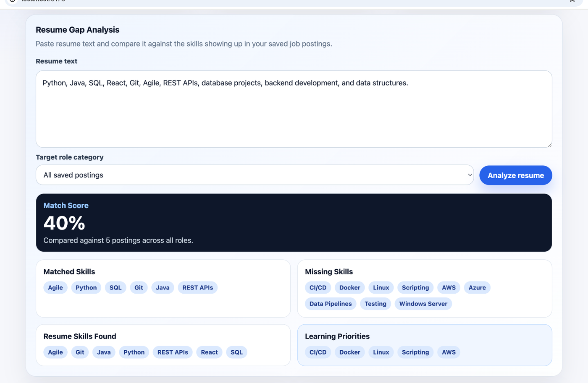
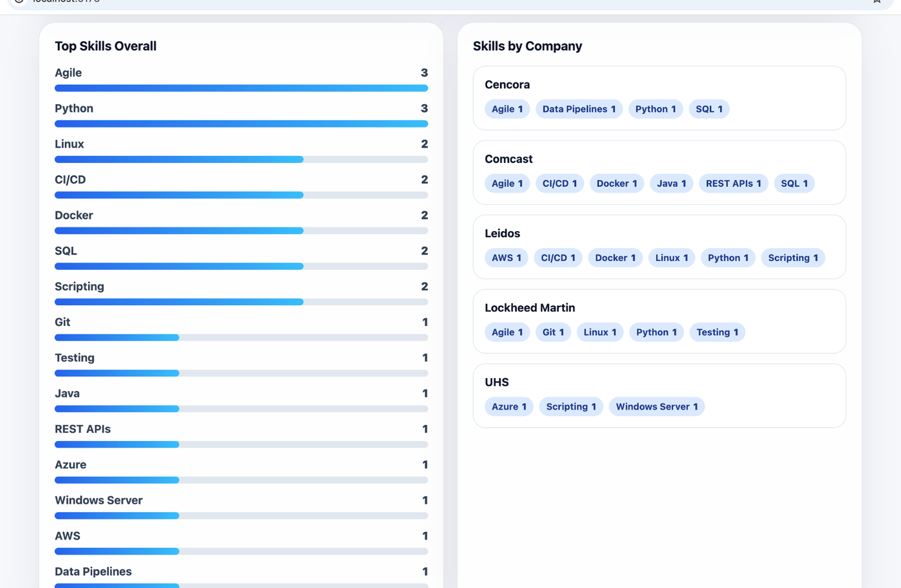
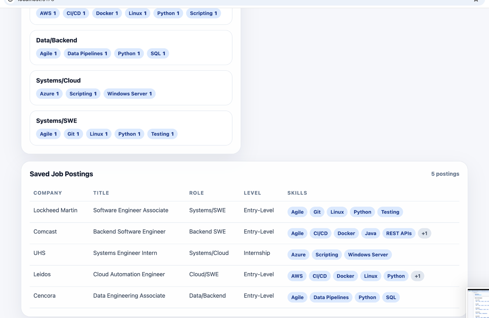
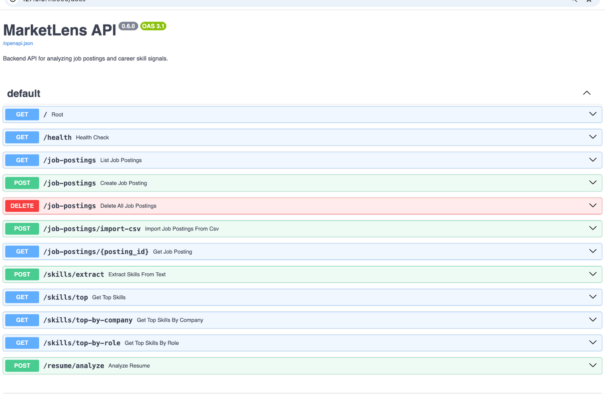

# MarketLens Career Intelligence

MarketLens is a full-stack career intelligence platform that analyzes job postings to identify in-demand skills, compare role requirements, and generate personalized resume skill-gap insights for early-career software, AI, cloud, and systems roles.

## Problem

Career advice is often vague, and job descriptions are noisy. Students and early-career candidates are told to “learn cloud,” “build projects,” or “get better at AI,” but it is hard to know which skills are actually showing up in the roles they want.

MarketLens turns messy job postings into evidence. Instead of guessing what to learn next, users can analyze postings and see which skills, tools, and experience patterns appear most often.

## Current Demo Model

The current deployed version is a safe portfolio/demo app.

Public visitors can:

- view the saved demo job posting dataset
- view top skills, company breakdowns, and role-category breakdowns
- run resume gap analysis against the saved demo dataset
- extract skills from pasted non-sensitive text

Admin-only actions require the `X-Admin-API-Key` header:

- `POST /job-postings`
- `POST /job-postings/import-csv`
- `DELETE /job-postings`

This keeps the public demo useful while preventing anonymous users from modifying or deleting shared demo data.

## Demo

### Resume Gap Analysis

MarketLens compares pasted resume text against the skills extracted from saved job postings, then returns a match score, matched skills, missing skills, and learning priorities.



### Skill Trend Dashboard

The dashboard summarizes saved postings, unique skills, top skills, company-specific skill signals, role-category skill signals, and saved job posting details.



### Saved Job Postings

Imported postings are persisted in a database and displayed with extracted technical skills.



### FastAPI Documentation

The backend exposes documented API endpoints through Swagger UI, including skill extraction, skill comparison, resume analysis, and admin-protected CSV import.



## MVP Goal

The first version of MarketLens focuses on a Job Skill Analyzer and Resume Gap Analyzer.

Users can:

- store posting details such as company, title, location, role category, and description
- extract technical skills from job descriptions
- view top skills by frequency
- compare skill requirements across companies and role categories
- paste resume-style text and compare it against target job postings
- generate a skill-gap report with recommended learning priorities

## Current Backend Features

The FastAPI backend currently supports:

- `GET /health` — health check
- `GET /job-postings` — list saved job postings
- `GET /job-postings/{posting_id}` — retrieve one saved job posting
- `POST /skills/extract` — extract skills from pasted text
- `GET /skills/top` — view overall skill frequency
- `GET /skills/top-by-company` — compare skill frequency by company
- `GET /skills/top-by-role` — compare skill frequency by role category
- `POST /resume/analyze` — compare resume skills against saved postings
- `POST /job-postings` — admin-protected manual job posting creation
- `POST /job-postings/import-csv` — admin-protected CSV import
- `DELETE /job-postings` — admin-protected clearing of saved postings

## Current Frontend Features

The React frontend currently supports:

- dashboard summary cards
- saved job posting table
- overall top skills list with simple bar visuals
- skills grouped by company
- skills grouped by role category
- resume gap analysis panel
- target role category dropdown generated from saved postings
- match score, matched skills, missing skills, resume skills, and learning priorities
- refresh button for reloading backend data
- empty and error states

## Security and Privacy Notes

MarketLens is currently a portfolio/demo application, not a production service for sensitive personal data.

Current security controls include:

- admin API key protection for write/delete endpoints
- CORS configuration for the deployed frontend origin
- request size limits on free-text fields
- CSV upload size and row-count limits
- basic public endpoint rate limiting for analysis endpoints
- SQLAlchemy ORM usage instead of raw string-built SQL queries
- Dependabot checks for backend, frontend, and GitHub Actions dependencies

Do not upload real Social Security numbers, addresses, phone numbers, medical details, financial details, API keys, passwords, database URLs, or confidential employer/customer data.

See [`SECURITY.md`](SECURITY.md) for the security policy and known limitations.

## Quality and CI

MarketLens includes automated quality checks so future changes are less likely to break existing behavior.

Current checks include:

- backend unit tests for skill extraction
- backend API tests for job posting creation, CSV import, admin API key protection, input validation, skill counting, and resume analysis
- frontend production build validation
- Docker image build validation for the backend and frontend
- GitHub Actions continuous integration on pushes and pull requests to `main`
- weekly Dependabot dependency checks

## Resume Gap Analysis

The resume analyzer compares skills extracted from pasted resume-style text against skills extracted from saved job postings.

Users can compare against all saved postings or narrow the analysis to one role category, such as `Backend SWE`, `Systems/Cloud`, or `Data/Backend`.

The analysis returns:

- resume skills found
- target skills from job postings
- matched skills
- missing skills
- match percentage
- learning priorities based on missing high-frequency skills

## Persistence

MarketLens uses SQLAlchemy for database-backed storage.

For local development, the backend defaults to SQLite:

```text
sqlite:///./marketlens.db
```

That means saved and imported job postings persist after the backend restarts.

In Docker, the backend uses a named Docker volume and stores SQLite data at:

```text
/app/data/marketlens.db
```

For public deployment, MarketLens uses PostgreSQL by setting a `DATABASE_URL` environment variable.

## CSV Format

CSV imports should use this header row:

```csv
company,title,location,role_category,experience_level,description
```

Required columns:

- `company`
- `title`
- `description`

Optional columns:

- `location`
- `role_category`
- `experience_level`

A sample file is included at:

```text
data/sample_job_postings.csv
```

CSV import is admin-protected in the deployed demo and requires the `X-Admin-API-Key` header.

## Running with Docker

From the project root:

```bash
docker compose up --build
```

Then open:

```text
http://localhost:5173
```

The backend API will be available at:

```text
http://localhost:8000
```

FastAPI docs will be available at:

```text
http://localhost:8000/docs
```

Stop the containers with:

```bash
docker compose down
```

To also delete the Docker-managed SQLite database volume:

```bash
docker compose down -v
```

## Railway Deployment

MarketLens is prepared for Railway deployment as an isolated monorepo with separate backend and frontend services plus a Railway Postgres database.

Deployment guide:

```text
docs/railway-deployment.md
```

Expected Railway services:

- `backend` from `/backend`
- `frontend` from `/frontend`
- `Postgres` database service

Important backend variables:

```text
DATABASE_URL=<Railway Postgres connection string>
ADMIN_API_KEY=<long random secret value>
CORS_ALLOWED_ORIGINS=<public frontend Railway URL>
```

Important frontend variable:

```text
VITE_API_BASE_URL=<public backend Railway URL>
```

Never commit or publicly share `DATABASE_URL`, Postgres connection strings, `ADMIN_API_KEY`, GitHub tokens, or other secrets.

## Running the Backend Locally

From the project root:

```bash
cd backend
source .venv/bin/activate
python -m pip install -r requirements.txt
python -m uvicorn app.main:app --reload
```

Then open:

```text
http://127.0.0.1:8000/docs
```

For local admin-protected endpoints, set an admin key before starting the backend:

```bash
export ADMIN_API_KEY=local-dev-admin-key
```

Then pass this header in Swagger or API requests:

```text
X-Admin-API-Key: local-dev-admin-key
```

## Running the Frontend Locally

Open a second terminal tab from the project root:

```bash
cd frontend
npm install
npm run dev
```

Then open:

```text
http://localhost:5173
```

The frontend expects the backend to be running at:

```text
http://127.0.0.1:8000
```

You can override that by creating a local `.env` file inside `frontend/`:

```text
VITE_API_BASE_URL=http://127.0.0.1:8000
```

## Running Quality Checks Locally

Run backend tests:

```bash
cd backend
source .venv/bin/activate
python -m pip install -r requirements.txt
python -m pytest
```

Run the frontend production build:

```bash
cd frontend
npm install
npm run build
```

Build Docker images:

```bash
docker build -t marketlens-backend ./backend
docker build --build-arg VITE_API_BASE_URL=http://localhost:8000 -t marketlens-frontend ./frontend
```

## Planned Tech Stack

- **Frontend:** React + TypeScript
- **Backend:** Python + FastAPI
- **Database:** SQLite locally, PostgreSQL in deployment
- **AI/NLP:** skill dictionary first, AI-assisted extraction later
- **Charts:** Recharts or Chart.js
- **DevOps:** Docker + GitHub Actions
- **Deployment:** Railway

## Project Structure

```text
.github/
  dependabot.yml
  workflows/
    ci.yml
backend/
  app/
    database.py
    main.py
    models.py
    skill_extractor.py
  tests/
    test_api.py
    test_skill_extractor.py
  .dockerignore
  Dockerfile
  requirements.txt
frontend/
  src/
    api.ts
    App.tsx
    main.tsx
    styles.css
    types.ts
  .dockerignore
  Dockerfile
  docker-entrypoint.sh
  nginx.conf
  package.json
  package-lock.json
  tsconfig.json
  tsconfig.node.json
  index.html
data/
  sample_job_postings.csv
docs/
  images/
    marketlens-api-docs.png
    marketlens-job-postings.png
    marketlens-resume-gap-analysis.png
    marketlens-skills-dashboard.png
  auth-user-ownership-roadmap.md
  database-schema.md
  project-plan.md
  railway-deployment.md
SECURITY.md
docker-compose.yml
README.md
```

## Roadmap

### Phase 1: Project Foundation

- Create project structure
- Write README and planning docs
- Set up FastAPI backend
- Add a health-check endpoint

### Phase 2: Job Posting Storage

- Define job posting data model
- Add create/list API endpoints
- Add sample job posting data
- Add CSV import for batches of job postings
- Add database-backed persistence
- Prepare PostgreSQL support through `DATABASE_URL`

### Phase 3: Skill Extraction

- Build a skill dictionary
- Extract skills from job descriptions
- Normalize skill names such as `AWS`, `Amazon Web Services`, and `cloud`
- Store extracted job-skill relationships

### Phase 4: Dashboard

- Build React dashboard
- Show top skills overall
- Compare skills by company
- Compare skills by role category

### Phase 5: Resume Gap Analysis

- Accept pasted resume-style text
- Extract resume skills
- Compare resume skills against selected postings
- Generate strong matches, missing skills, and suggested learning priorities

### Phase 6: Polish, Quality, Deployment, and Demo Safety

- Add screenshots and a demo write-up
- Add backend tests
- Add GitHub Actions CI
- Add Docker setup
- Prepare Railway deployment
- Deploy the app
- Add admin API key protection for shared demo data
- Add input limits, basic public rate limiting, `SECURITY.md`, and Dependabot

### Phase 7: User Accounts and Ownership

Planned next major product direction:

- add authentication
- add user-owned job postings
- add per-user dashboards and resume analysis
- allow logged-in users to create/import/delete only their own records
- consider PostgreSQL Row Level Security after ownership is stable

See [`docs/auth-user-ownership-roadmap.md`](docs/auth-user-ownership-roadmap.md).

## Long-Term Ideas

- public non-persistent custom analysis for pasted user job descriptions
- AI-generated learning roadmaps
- company-specific career intelligence
- regional market trends
- role comparison between backend, systems, cloud, and AI jobs
- vector search over job postings
- authentication and saved user profiles
- browser extension for saving postings from job sites
- public job API integrations
- production security hardening, monitoring, and accessibility improvements

## Status

MarketLens is currently at **Full-Stack MVP v0.7 secured demo**. The backend can accept admin-protected manual job postings, import postings from CSV, persist postings in SQLite locally or PostgreSQL in deployment, extract skills, return skill-frequency comparisons, and compare resume skills against target postings. The frontend displays those insights in a React dashboard with a resume gap analysis workflow. The repo includes backend tests, GitHub Actions CI, Docker support, Railway deployment prep, a security policy, Dependabot configuration, and a user-auth/ownership roadmap.
