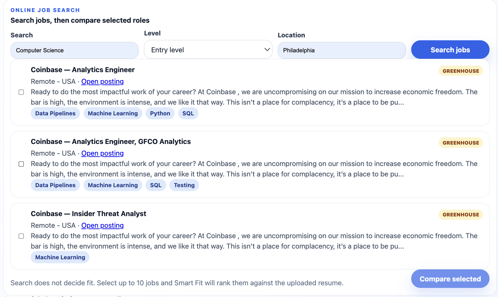
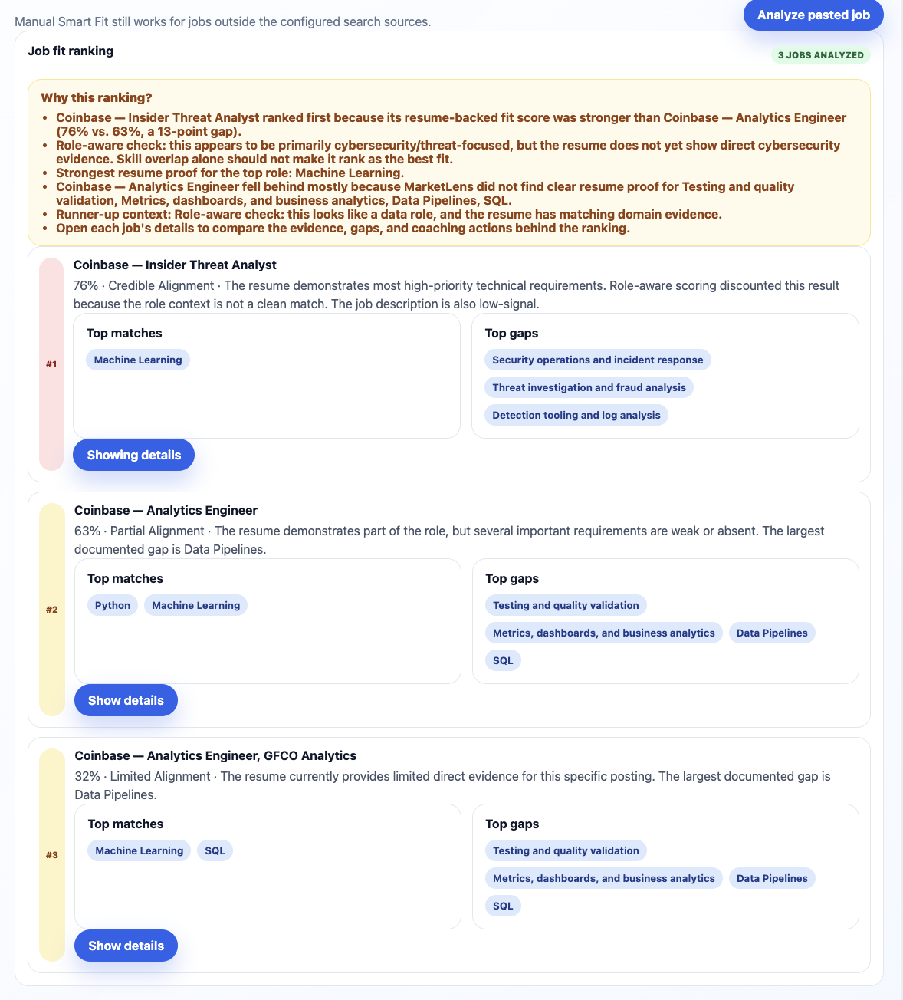
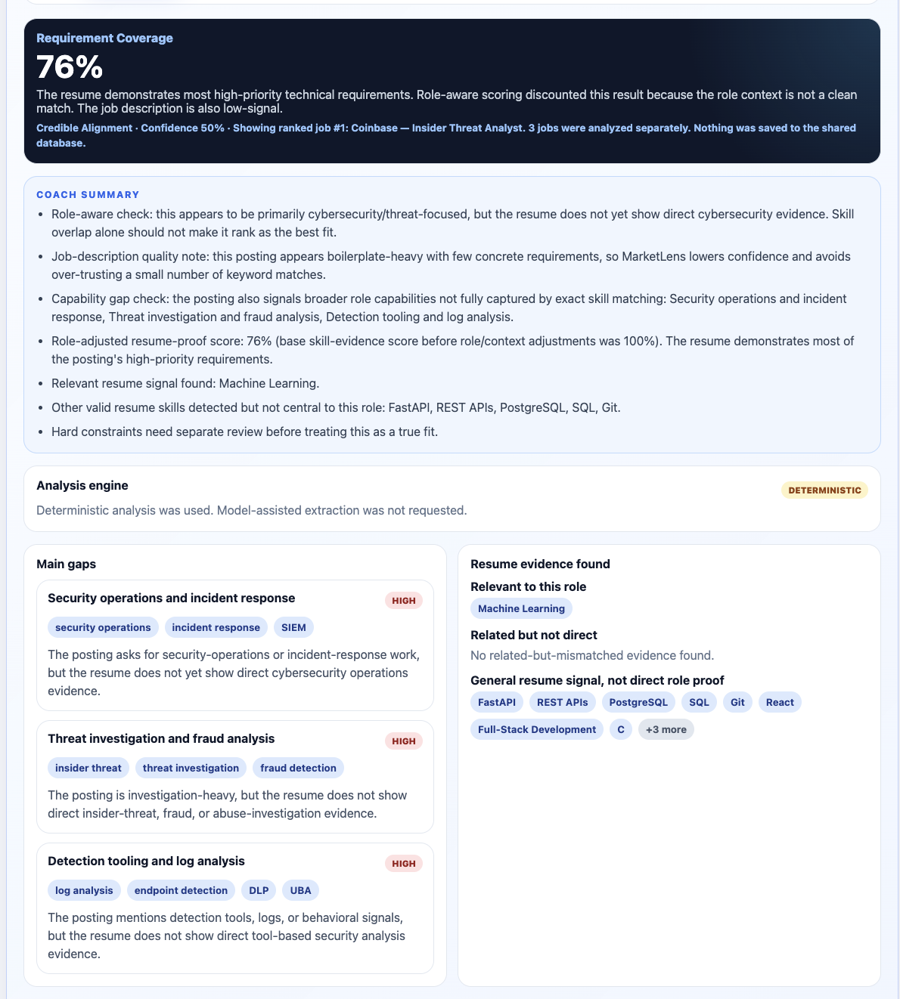
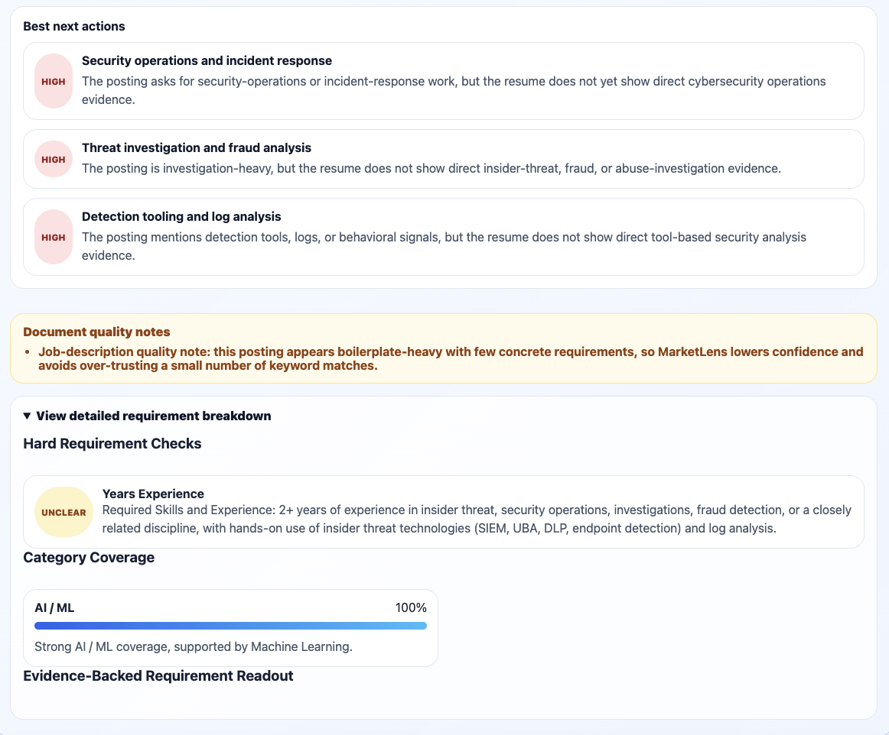

# MarketLens Career Intelligence

MarketLens is a deployed full-stack career-intelligence platform that searches configured public job sources, compares résumé evidence against real job descriptions, ranks role fit, and helps users turn opportunities, strengths, and evidence gaps into a reviewable career plan.

The project now contains two connected product surfaces:

1. **Job Intelligence** — public-source search and role-aware Smart Fit comparison.
2. **Career Plans** — a private, resumable, bounded AI-agent workflow that searches, selects, analyzes, synthesizes, explains, and proposes next actions while keeping the user in control.

## Project highlights

- **Deployed full-stack product:** React + TypeScript frontend, FastAPI backend, SQLAlchemy persistence, Clerk authentication, Docker packaging, and Railway deployment.
- **Bounded Career Planning Agent:** a durable seven-step workflow using existing job-search and Smart Fit tools rather than duplicating scoring logic inside a prompt.
- **Cross-sector job search:** occupation-aware matching across technology, business, education, science, engineering, healthcare, public service, creative work, trades, agriculture, hospitality, transportation, and service work.
- **Role-aware Smart Fit:** evidence-backed scoring, hard-requirement assessment, capability gaps, ranking explanations, and deterministic coaching actions.
- **Optional AI with strict authority limits:** model output may organize an already-completed deterministic plan but cannot alter scores, evidence, hard requirements, provenance, job selection, action types, approval state, or external systems.
- **Private and resumable workspace:** authenticated users can save jobs, reduced Smart Fit summaries, Career Plan runs, workflow steps, decisions, and safe audit metadata.
- **Permanent adversarial evaluation:** ten-sector agent fixtures, provider-failure matrices, prompt-injection cases, ownership isolation, retry recovery, privacy checks, and explicit model budgets.

## Tech stack

| Area | Tools |
| --- | --- |
| Frontend | React, TypeScript, Vite, CSS |
| Backend | Python, FastAPI, Pydantic, SQLAlchemy |
| Database | SQLite locally; PostgreSQL through `DATABASE_URL` in deployment |
| Authentication | Clerk frontend sessions with backend token verification |
| Job sources | Greenhouse, Lever, named SmartRecruiters employer boards, Remote OK, Remotive |
| AI integration | Backend-only Responses API configuration with strict schemas and deterministic fallback |
| Testing / quality | pytest, deterministic evaluations, adversarial fixtures, GitHub Actions, Docker builds |
| Deployment | Railway frontend and backend services |

## Live demo

- **Frontend:** [MarketLens live demo](https://marketlens-career-intelligence-production-8a34.up.railway.app)
- **Backend API docs:** [FastAPI Swagger UI](https://marketlens-career-intelligence-production.up.railway.app/docs)
- **Backend health:** [API health endpoint](https://marketlens-career-intelligence-production.up.railway.app/health)
- **Deployment identity:** [Safe backend revision endpoint](https://marketlens-career-intelligence-production.up.railway.app/deployment/status)
- **Portfolio walkthrough:** [How to demo MarketLens](docs/portfolio-demo-walkthrough.md)
- **Agent evaluation:** [Milestone 8.1 evaluation record](docs/milestone-8-1-agent-evaluation.md)
- **Milestone 8.1 completion decision:** [Production sign-off record](docs/milestone-8-1-completion.md)

The deployed application is a portfolio product. Do not upload secrets, API keys, confidential employer/customer data, or highly sensitive personal information.

## Screenshots

### Online job search

MarketLens searches configured public sources and reports exactly which providers were attempted.



### Ranked Smart Fit comparison

Users can compare multiple jobs against one résumé and inspect why one opportunity ranked above another.



### Role-aware gap report

Reports distinguish direct résumé proof from broader signals and surface role-specific capability gaps.



### Coaching actions and requirements

Deterministic recommendations keep hard requirements separate from broader career-development guidance.



Authenticated Career Plan screenshots are intentionally gated on the final exact-revision production browser canary in Milestone 8.1F. They will not be represented by mock or local-only images.

## Current product workflow

### Job Intelligence

```text
Open MarketLens
Optionally sign in for private saving
Upload or paste a résumé
Search configured public job sources
Choose occupation, experience level, and optional location
Inspect provider coverage and bounded results
Select one or more jobs
Run role-aware Smart Fit
Review ranking, evidence, requirements, gaps, and coaching
Explicitly save jobs or reduced reports when signed in
```

Manual comparison remains available for postings outside configured public sources:

```text
Upload or paste a résumé
Paste one or more job descriptions
Separate multiple postings with ---
Run Smart Fit and compare results
Explicitly save a reduced report when signed in
```

### Career Planning Agent

```text
Sign in
Open Career Plans
Define a target occupation and practical constraints
Provide a résumé for request-time analysis
Create and execute a bounded planning run
Watch seven persisted workflow steps
Inspect source coverage and candidate selection/exclusion reasons
Review opportunity categories, recurring strengths, recurring gaps, and actions
Inspect deterministic reasoning and optional AI contribution
Ask bounded “Why?” questions
Edit, approve, reject, save, reopen, retry, cancel, or delete the plan
```

The seven workflow steps are:

1. validate input
2. search jobs
3. select candidates
4. analyze Smart Fit
5. synthesize deterministic plan
6. optionally organize the plan with one bounded model call
7. finalize the proposal for human review

## What makes the agent bounded

MarketLens is not an unrestricted career chatbot and does not autonomously act on the user’s behalf.

The agent:

- calls the existing search and Smart Fit implementations through typed boundaries
- analyzes at most five jobs per run
- creates at most twenty proposed actions
- uses at most one Career Plan model call
- persists workflow state, attempts, safe summaries, and audit events
- treats job content as untrusted data
- returns a complete deterministic plan when AI is disabled or fails
- requires an explicit user decision before a plan becomes approved or rejected

The model cannot:

- change Smart Fit scores or confidence
- change evidence statuses or provenance
- override hard-requirement findings
- add jobs or deterministic actions
- invent experience, credentials, projects, or résumé claims
- apply to jobs, message recruiters, edit profiles, or purchase services
- bypass authentication or human approval
- predict interviews, offers, salary, or hiring probability

## Search correctness contract

MarketLens evaluates occupation, experience level, industry, and location as separate concerns.

### Occupation relevance

Specific occupations require title-level evidence. A shared word such as `engineer`, `analyst`, `assistant`, `technician`, `editor`, or `manager` is not sufficient by itself.

Protected distinctions include:

- electrical engineer vs. analytics engineer
- elementary teacher vs. middle-school teacher
- electrician vs. electrical engineer
- medical assistant vs. registered nurse
- policy analyst vs. data analyst
- journalism editor/reporter vs. video editor
- social worker vs. social-media manager

### Experience level

Supported levels are `any`, `intern`, `entry`, `mid`, and `senior`. The matcher uses guarded title and written-experience evidence rather than blindly treating every unlabeled posting as entry level.

### Location

Explicit city searches are strict. Philadelphia includes recognized metro locations such as King of Prussia, Malvern, West Chester, Camden, Cherry Hill, Mount Laurel, and Wilmington while excluding Pittsburgh, New York, California, and remote-only postings unless remote was requested.

### Source coverage

MarketLens uses public APIs rather than scraping closed platforms:

- Greenhouse Job Board API
- Lever Postings API
- bounded named SmartRecruiters employer boards
- Remote OK public feed
- Remotive public API

MarketLens does not claim to search all of LinkedIn, Indeed, Handshake, Workday, school portals, or every company career site. Those remain external continuation options.

## Current capabilities

All visitors can:

- view sample market data
- upload `.txt`, `.md`, `.pdf`, or `.docx` résumés for request-time extraction
- paste résumé text manually
- search configured public sources
- inspect provider-by-provider coverage, warnings, suggestions, and continuation links
- compare one to ten searched or manually pasted jobs through Smart Fit
- review requirements, evidence, rankings, gaps, limitations, and coaching actions
- use deterministic analysis when model-assisted stages are unavailable

Signed-in users can additionally:

- save, reopen, and delete jobs privately
- explicitly save and delete reduced Smart Fit summaries
- create private Career Plan runs
- inspect all seven workflow steps and safe audit history
- cancel and retry active or failed runs
- review selected and excluded candidates with deterministic reason codes
- inspect opportunity categories, repeated strengths, repeated gaps, and proposed actions
- request bounded explanations from saved plan data
- edit, approve, reject, reopen, and delete owned plans

## Backend API

Important public endpoints include:

- `GET /health`
- `GET /deployment/status`
- `GET /jobs/search`
- `POST /skills/extract`
- `POST /analysis/resume-file/extract`
- `POST /analysis/smart`
- `POST /analysis/smart/batch`
- `GET /analysis/model-status`

Authenticated endpoints include:

- saved-job create/list/read/delete
- saved-report create/list/read/delete
- `POST /career-plans`
- `GET /career-plans`
- `GET /career-plans/{run_id}`
- `POST /career-plans/{run_id}/execute`
- `POST /career-plans/{run_id}/cancel`
- `POST /career-plans/{run_id}/explain`
- `POST /career-plans/{run_id}/decision`
- `DELETE /career-plans/{run_id}`

Shared posting creation, CSV import, and deletion remain admin-only operations protected by `X-Admin-API-Key`.

## Security and privacy

Current controls include:

- Clerk-managed authentication instead of custom password storage
- backend verification of Clerk session tokens
- server-side ownership filters for every private resource
- cross-user private-record access returning `404`
- no automatic persistence of analysis inputs
- raw résumé text and full job descriptions excluded from Career Plan and saved-report records
- backend-only model-provider keys
- request-scoped redaction and sensitive-log context
- strict model response schemas and reference validation
- public request, file, CSV, search, and provider bounds
- safe HTTPS application-link validation
- SQLAlchemy ORM usage
- secret scanning and log-redaction CI
- explicit deterministic fallback for provider failure

See [`SECURITY.md`](SECURITY.md) for the security policy and limitations.

## Evaluation and CI

The integrated Milestone 8.1 implementation passed:

- ten representative career sectors
- ten committed task-level cases
- three repeated deterministic executions per case
- thirty stable agent executions with zero failed cases
- prompt-injection inputs across descriptions, titles, company metadata, and URLs
- model timeout, transport, HTTP, invalid JSON, schema, reference, duplicate, and policy-changing output cases
- cancellation and failed-run retry recovery without duplicated actions
- ownership-isolation and private mutation tests
- provider telemetry, cost, token, payload, and latency policy checks
- frontend TypeScript/Vite production build
- backend and frontend Docker builds
- Operational Reliability, Provider Resilience, Provider Telemetry, Smart Fit Evaluation, Career Plan Agent Evaluation, and Secret and Log Safety workflows

Milestone 8.1F adds an exact-revision Railway canary. Public mode checks both deployed revisions, the Career Plan frontend bundle, live job search, deterministic Smart Fit, model status, and private-route authentication boundaries. Full mode additionally requires configured authenticated canary identities and exercises the private Career Plan lifecycle.

## Running locally

### Backend

```bash
cd backend
python -m venv .venv
source .venv/bin/activate
python -m pip install --upgrade pip
python -m pip install -r requirements.txt
python -m uvicorn app.main:app --reload
```

### Frontend

```bash
cd frontend
npm install
npm run dev
```

The frontend reads `VITE_API_BASE_URL` and `VITE_CLERK_PUBLISHABLE_KEY`. Railway runtime configuration also exposes a sanitized deployment revision through `config.js`.

### Quality checks

```bash
cd backend
python -m pytest
python scripts/run_job_search_evaluation.py
python scripts/run_career_plan_agent_evaluation.py
```

```bash
cd frontend
npm ci
npm run build
```

```bash
docker build -t marketlens-backend ./backend
docker build --build-arg VITE_API_BASE_URL=http://localhost:8000 -t marketlens-frontend ./frontend
```

Production public canary:

```bash
cd backend
EXPECTED_REVISION=<40-character-sha> \
CANARY_WAIT_SECONDS=900 \
python scripts/run_production_career_plan_canary.py --mode public
```

Full authenticated mode additionally requires short-lived canary bearer tokens stored outside the repository.

## Portfolio and interview summary

MarketLens is a deployed, stateful career-intelligence product. It combines public job-source integrations, evidence-aware analysis, private workflow persistence, and a bounded AI agent that orchestrates search and Smart Fit tools while preserving deterministic authority and human approval.

Suggested résumé bullet:

```text
Built and deployed MarketLens, a React/FastAPI career-intelligence platform with a bounded AI planning agent that orchestrates public job search and evidence-based résumé analysis, persists resumable user-owned workflows, falls back deterministically on model failure, and is validated through adversarial, privacy, recovery, Docker, and production canary gates.
```

## Milestone status

Completed implementation work:

- Milestones 1–7.1: search, Smart Fit, deployment, authentication, private saving, source coverage, and cross-sector correctness
- Milestone 8: optional model-assisted extraction and personalized coaching foundations
- Milestone 8.1A–8.1E: Career Plan architecture, deterministic orchestration, bounded model organization, authenticated UI, and permanent evaluation/security gates

Final sign-off work:

- Milestone 8.1F: exact-revision deployment proof, production canaries, authenticated browser validation, screenshots, and final GO/NO-GO record

## Explicit post-launch roadmap

The following are not implemented by Milestone 8.1:

- autonomous or mass job applications
- recruiter messaging or email automation
- external profile editing
- course or service purchasing
- unrestricted multi-agent delegation
- closed-platform scraping
- full Career Evidence Graph
- GitHub evidence verification
- résumé claim verification
- complete application tracker and outcome-learning loop
- long-term labor-market trend forecasting
- guaranteed interview, offer, salary, or career outcomes
