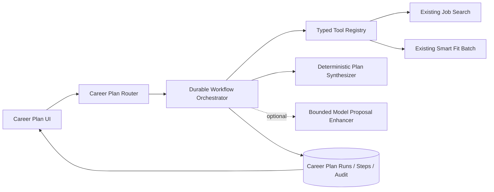
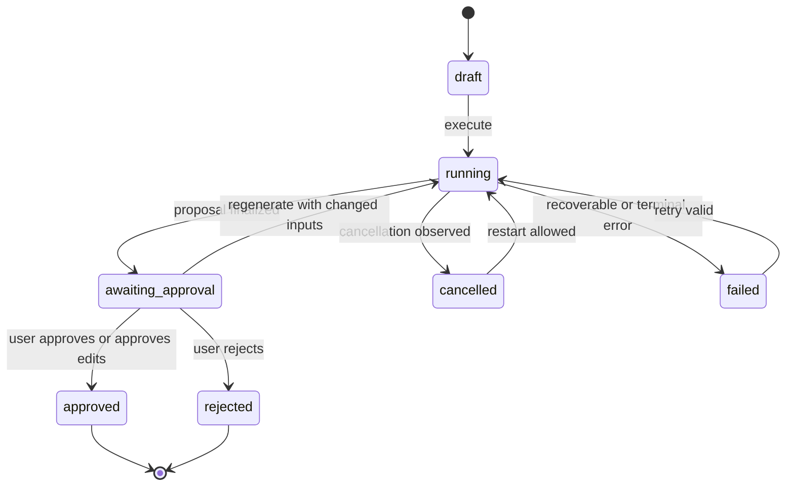

# Milestone 8.1 Career Planning Agent Design

Status: proposed implementation contract  
Parent: #80  
Workstream: #81

## 1. Decision summary

MarketLens will add one bounded Career Planning Agent implemented as a durable, authenticated workflow orchestrator.

The first release is deliberately **not** an unrestricted chatbot, autonomous application bot, or multi-agent system. It coordinates existing MarketLens capabilities in a fixed, inspectable sequence:

1. validate a career goal and constraints
2. call the existing public job-search implementation
3. deterministically select a bounded candidate set
4. call the existing Smart Fit batch implementation
5. build a complete deterministic opportunity portfolio and action plan
6. optionally ask one model stage to reorganize or personalize that already-grounded proposal
7. require the user to approve, edit, reject, or save the proposal

The workflow must remain complete and useful when every model-assisted stage is disabled or fails.

## 2. Product contract

### Primary user story

As a signed-in user, I can define a target career direction and practical constraints, ask MarketLens to evaluate a controlled set of current opportunities, watch the workflow progress, inspect the evidence and exclusions behind its recommendations, and save a plan I control.

### First launch scenario

A user provides:

- target occupation or role phrase
- experience level
- optional industry
- optional location
- work-mode preference
- portfolio strategy
- resume text for request-time analysis

MarketLens returns:

- jobs considered and source coverage
- jobs selected and excluded, with reason codes
- a bounded opportunity portfolio
- recurring strengths
- recurring gaps
- hard-requirement warnings
- prioritized actions
- limitations and fallback status
- an approval state separate from the generated proposal

### Launch non-goals

Milestone 8.1 will not:

- submit applications
- send email or recruiter outreach
- edit external profiles
- purchase courses or services
- scrape closed job platforms
- run a general-purpose chatbot
- delegate to multiple autonomous agents
- make hiring, interview, salary, or career-outcome guarantees
- implement the full Career Evidence Graph
- implement the full application tracker or outcome-learning loop

## 3. Existing authoritative capabilities

The agent must wrap, not reproduce, these implementations:

- `app.job_search.search_external_jobs`
- `app.analysis.analyze_smart_fit`
- the Smart Fit batch ranking behavior currently exposed by `POST /analysis/smart/batch`
- existing URL sanitization, authentication, ownership, rate-limit, provenance, grounding, and telemetry controls

The agent may introduce adapters around those functions so they can be invoked through typed workflow tools. It must not copy search ranking rules, occupation logic, location logic, Smart Fit scoring, evidence assessment, hard-requirement logic, or deterministic coaching into prompts.

## 4. Architecture



### Core modules

Proposed backend structure:

```text
backend/app/career_plans/
  __init__.py
  router.py
  schemas.py
  models.py or shared additions in app/models.py
  state_machine.py
  orchestrator.py
  tool_registry.py
  tools/
    job_search_tool.py
    smart_fit_tool.py
  deterministic_planner.py
  model_planner.py
  validation.py
  telemetry.py
  errors.py
```

The router is included from `app.main` in the same style as the existing saved-job and saved-report routers.

Proposed frontend structure:

```text
frontend/src/career-plans/
  CareerPlanWorkspace.tsx
  CareerPlanForm.tsx
  CareerPlanProgress.tsx
  CareerPlanProposal.tsx
  CareerPlanHistory.tsx
  careerPlanApi.ts
  careerPlanTypes.ts
```

The initial UI may reuse shared controls from Smart Fit, but Career Plan state must be isolated from the existing mounted Smart Fit state.

## 5. Orchestration model

### One orchestrator

Milestone 8.1 uses one explicit state machine. The model does not choose arbitrary tools, invent tool names, alter tool arguments outside validated fields, or recursively delegate work.

This is an agentic workflow because it:

- receives a goal
- maintains durable state
- invokes multiple specialized tools
- reacts to tool results and failures
- produces a proposal
- pauses for human approval
- supports cancellation, retry, and resume
- records an audit trail

It is intentionally more constrained than an autonomous LLM agent.

### Request-driven execution

The first implementation will not require a separate queue or background-worker service.

- `POST /career-plans` creates a durable run.
- `POST /career-plans/{id}/execute` receives request-time resume text and advances the run.
- The execute request commits step transitions before and after each major stage.
- The frontend may poll `GET /career-plans/{id}` while execution is active.
- `POST /career-plans/{id}/cancel` sets a cancellation request checked between bounded stages.
- A later execute/retry request resumes from the last safe completed step.

Raw resume text and full job descriptions remain in request/runtime memory only. They are not written to Career Plan tables, logs, audit payloads, or telemetry.

If a run stops before derived Smart Fit results are safely persisted, the response sets `resume_required_to_resume=true`; the user must provide the resume again. Completed derived steps are not rerun when their input fingerprint still matches.

A future queue/worker architecture may replace request-driven execution without changing the public run, step, proposal, approval, or audit contracts.

## 6. Run state machine

### Run statuses

```text
draft
running
awaiting_approval
approved
rejected
cancelled
failed
```

### Step names

```text
validate_input
search_jobs
select_candidates
analyze_smart_fit
synthesize_deterministic_plan
enhance_plan_optional
finalize_proposal
```

### Step statuses

```text
pending
running
completed
skipped
cancelled
failed
```

### Allowed transitions



Rules:

- terminal user decisions never occur implicitly
- model success is not required to reach `awaiting_approval`
- no transition may skip ownership checks
- completed steps are immutable for an execution attempt
- retry creates a new bounded attempt number and preserves prior safe audit entries
- changed goal, constraints, resume fingerprint, or selected-job fingerprint invalidates dependent downstream steps
- no-results is a valid completed proposal with limitations, not an internal failure

## 7. Input contract

### `CareerPlanGoal`

Proposed fields:

```text
target_occupation: string, 1..100 characters
experience_level: any | intern | entry | mid | senior
industry: optional string, max 80 characters
location: optional string, max 120 characters
work_mode: any | onsite | hybrid | remote
portfolio_strategy: conservative | balanced | ambitious
max_jobs_to_analyze: integer, 1..5, default 5
model_assisted_planning: boolean, default false
```

The occupation, experience level, industry, and location are passed through existing search intent parsing. `work_mode` is a user preference used for portfolio explanation and filtering only where source metadata supports it; MarketLens must not infer unavailable work-mode facts.

### Request-time execution input

```text
resume_text: string, 1..25,000 characters
idempotency_key: optional opaque client key
expected_run_version: integer
```

The backend computes a one-way input fingerprint for retry/idempotency comparisons. The fingerprint is not reversible and is not presented as a secure document archive.

## 8. Typed tool registry

Every tool invocation records:

```text
tool_name
tool_version
attempt
started_at
completed_at
outcome
safe_status_code
input_fingerprint
safe_output_summary
latency_ms
```

No tool log stores raw resume text or full job descriptions.

### Tool 1: `career.search_jobs.v1`

Input:

```text
query
location
level
limit
```

Implementation:

- adapter over `search_external_jobs`
- use existing source routing, provider budget, matching, ranking, warnings, coverage, and external links

Ephemeral output:

- complete `JobSearchResults`, including descriptions needed for the same execution

Persisted safe output:

- normalized query, location, level, role family, and industry
- providers searched
- source coverage counts and notes
- bounded candidate metadata: source, source job ID, company, title, location, safe apply URL, updated timestamp, extracted skill labels
- warnings and search suggestions
- no full description

Safe status codes:

```text
ok
no_results
partial_provider_failure
provider_failure
budget_exceeded
cancelled
internal_error
```

### Tool 2: `career.smart_fit_batch.v1`

Input:

```text
resume_text
bounded ephemeral candidate descriptions
use_model_assisted=false for the Milestone 8.1 launch path
```

Implementation:

- adapter over existing Smart Fit analysis and batch ranking
- maximum five jobs for the Career Planning workflow
- deterministic Smart Fit is authoritative for launch planning

Reason for deterministic launch default:

- complete provider independence
- bounded latency and cost
- stable cross-job comparison
- simpler prompt-injection boundary
- the optional model stage can personalize one reduced, already-grounded proposal rather than making repeated calls for every posting

Persisted safe output per job:

- job reference
- rank
- fit score, band, and confidence
- hard-requirement categories and statuses
- canonical requirement skill/status summaries
- category coverage
- strong-match labels
- important-gap labels
- coaching action labels and types
- limitations
- analysis engine/status/version fields
- derived evidence references
- no verbatim resume or job quotes
- no full requirement source text

Safe status codes:

```text
ok
invalid_input
analysis_failure
cancelled
internal_error
```

## 9. Safe evidence references

The Career Plan persistence layer stores compact derived references instead of raw quotes.

### `EvidenceRef`

```text
id: stable within run
kind: resume_evidence | job_requirement | hard_requirement | user_preference | source_coverage
job_ref: optional
capability: optional canonical label
assessment_status: optional
source_section: optional
source_origin: deterministic | model_assisted | merged | user
smart_fit_schema_version: optional
analysis_ref: optional stable result path
summary: deterministic redacted summary, max 240 characters
```

Example:

```json
{
  "id": "ev-job-2-python",
  "kind": "resume_evidence",
  "job_ref": "job-2",
  "capability": "Python",
  "assessment_status": "demonstrated",
  "source_section": "projects",
  "source_origin": "deterministic",
  "analysis_ref": "smart-fit/job-2/requirements/python",
  "summary": "Python evidence was identified in the Projects section."
}
```

The full request-time Smart Fit response may be shown during the active browser session. Reopened saved plans show the compact persisted evidence record unless the user separately saved an allowed Smart Fit report.

This reference format is intentionally compatible with a future Career Evidence Graph, but it does not create that graph in Milestone 8.1.

## 10. Deterministic candidate selection

The search tool may return more jobs than the planner analyzes. Selection must be explicit and reproducible.

Launch bounds:

```text
search result limit: 15
maximum analyzed jobs: 5
minimum analyzed jobs: 1
```

Selection order:

1. preserve existing search rank
2. reject duplicate source/source-job IDs
3. reject unsafe or missing application URLs only from external-action recommendations; the job may still be analyzed
4. preserve explicit occupation, level, and location semantics from search
5. prefer distinct companies when scores are otherwise comparable
6. stop at the user-selected bound

Every non-selected result receives a reason code such as:

```text
outside_analysis_limit
duplicate_posting
lower_search_rank
missing_safe_apply_url
provider_metadata_incomplete
```

The agent must not silently claim that non-selected jobs are poor fits; they were not Smart Fit analyzed.

## 11. Deterministic plan schema

### `CareerPlanProposal`

```text
schema_version
run_id
generated_at
proposal_engine
proposal_status
source_summary
portfolio
recurring_strengths
recurring_gaps
actions
limitations
warnings
fallback_status
```

### Opportunity portfolio entry

```text
job_ref
category: strong_match | balanced | stretch | skip
rank
fit_score
fit_band
confidence
reason_codes
evidence_refs
gap_refs
hard_requirement_flags
safe_apply_url
```

Initial deterministic category rules are configurable and must be calibrated in #82/#85. Proposed starting rules:

- any confirmed hard requirement failure: `skip`
- score at least 70, confidence at least 0.60, and no hard failure: `strong_match`
- score at least 50 and no hard failure: `balanced`
- score at least 30 and no hard failure: `stretch`
- otherwise: `skip`

These categories describe application strategy, not hiring probability.

### Recurring strength

```text
capability
job_count
job_refs
evidence_refs
summary
```

### Recurring gap

```text
capability
job_count
job_refs
priority: high | medium | low
evidence_refs
summary
```

A recurring item must appear in at least two analyzed jobs unless the item is an explicit hard requirement for a recommended job.

### Action

```text
id
action_type
priority
title
rationale
job_refs
evidence_refs
status: proposed | approved | edited | rejected | completed
```

Allowed launch action types:

```text
apply_now
verify_hard_requirement
strengthen_resume_evidence
prepare_interview_evidence
build_proof
save_for_later
skip_opportunity
```

No action performs an external side effect. `apply_now` means the user may choose to open the sanitized application URL.

## 12. Optional model-assisted planning

The model stage is an enhancer, not the orchestrator or authority.

### Allowed model task

Given a reduced deterministic proposal and explicit user preferences, the model may:

- improve ordering among already-valid actions
- rewrite summaries for clarity
- explain tradeoffs among already-analyzed jobs
- personalize the tone of the plan
- propose only actions from the allowlisted action types

### Forbidden model behavior

The model may not:

- add or remove jobs
- change scores, confidence, evidence statuses, hard requirements, provenance, or source coverage
- create unknown job or evidence references
- claim a new credential, skill, experience, salary, company fact, or hiring outcome
- call tools
- follow instructions originating in a posting
- perform external actions

### Prompt-injection boundary

The planning model receives no raw job descriptions and no raw resume text. It receives only validated reduced structures and safe derived summaries. External posting content therefore cannot directly issue instructions to the planning model.

The returned JSON is validated with `extra="forbid"`, bounded list lengths, allowlisted enums, reference checks, duplicate checks, and grounded-action checks. Any failure discards the entire enhancement and preserves the deterministic proposal unchanged.

### Model budget

Proposed defaults:

```text
maximum planning-model calls per attempt: 1
maximum model retries: 1
maximum output tokens: 2,000
maximum reduced prompt characters: 16,000
default provider timeout: 20 seconds
default estimated provider-cost ceiling: $0.10 per run
```

All values are backend configuration with stricter production limits allowed.

## 13. Persistence contract

### `CareerPlanRunDB`

Proposed fields:

```text
id
user_id
status
current_step
schema_version
run_version
attempt_count
goal_json
search_summary_json
proposal_json
approval_json
fallback_status
safe_error_code
resume_fingerprint
resume_required_to_resume
cancel_requested_at
created_at
updated_at
completed_at
```

### `CareerPlanStepDB`

```text
id
run_id
step_name
status
attempt
input_fingerprint
safe_output_summary_json
safe_error_code
started_at
completed_at
latency_ms
```

Unique constraint:

```text
(run_id, step_name, attempt)
```

### `CareerPlanAuditEventDB`

```text
id
run_id
sequence_number
event_type
safe_payload_json
created_at
```

Rules:

- audit events are append-only through application code
- maximum 100 events per run
- safe payloads contain IDs, counts, reason codes, versions, and statuses only
- no raw document content
- deletion of a run deletes its steps and audit events
- list/read/delete operations always filter by both run ID and authenticated user ID
- cross-user reads and mutations return `404`

The current project uses SQLAlchemy metadata creation rather than a full migration framework. #82 must explicitly validate the development, test, SQLite, and Railway PostgreSQL schema update path before merging.

## 14. API contract

All endpoints require authentication.

### Create

```http
POST /career-plans
```

Body:

```json
{
  "goal": {},
  "idempotency_key": "optional-client-key"
}
```

Returns `201` with the durable draft run.

### Execute or resume

```http
POST /career-plans/{run_id}/execute
```

Body:

```json
{
  "resume_text": "request-time only",
  "expected_run_version": 1
}
```

Returns the latest run representation. The frontend polls the read endpoint for visible progress while execution is active.

### List

```http
GET /career-plans
```

Returns compact owned run summaries without raw inputs.

### Read

```http
GET /career-plans/{run_id}
```

Returns the owned run, bounded steps, proposal, approval, and safe audit summary.

### Cancel

```http
POST /career-plans/{run_id}/cancel
```

Sets cancellation requested. The orchestrator checks the flag between stages and before persistence of a new proposal.

### Decide

```http
POST /career-plans/{run_id}/decision
```

Body:

```json
{
  "decision": "approved | rejected",
  "edited_actions": []
}
```

Edits are validated against the same action schema. The original generated proposal remains intact; the user decision is stored separately.

### Delete

```http
DELETE /career-plans/{run_id}
```

Deletes the owned run, steps, and audit events.

### Bounded explanation

Planned for #83/#84:

```http
POST /career-plans/{run_id}/explain
```

Allowed question types:

```text
why_recommended
why_excluded
why_action
most_common_gaps
highest_priority
```

The request references known job/action IDs. It is not a free-form general chatbot endpoint.

## 15. Idempotency, concurrency, retry, and cancellation

### Idempotency

- create may use a user-scoped idempotency key
- execute uses run version plus input fingerprint
- repeated identical execute requests return or continue the same attempt
- duplicate actions are rejected by stable action ID

### Concurrency

- run updates use optimistic `run_version`
- stale requests return `409` with safe code `stale_run_version`
- only one active execution attempt is allowed per run
- a second active execute request returns `409` with `run_already_active`

### Retry

- retries increment `attempt_count`
- completed upstream steps are reused only when their fingerprints match
- failed optional model enhancement can be skipped without rerunning search or Smart Fit
- failed Smart Fit execution requires request-time resume text again

### Cancellation

- cancellation is cooperative between bounded stages
- no new model call starts after cancellation is requested
- a completed deterministic proposal is not overwritten by a late optional model response
- cancelled runs may be restarted with a new attempt

## 16. Safe error codes

Public responses and persisted records use bounded codes rather than stack traces or provider bodies:

```text
invalid_goal
resume_required
resume_too_large
no_jobs_found
search_provider_failure
provider_budget_exceeded
selection_empty
smart_fit_invalid_input
smart_fit_failure
model_not_configured
model_timeout
model_transport_error
model_http_error
model_invalid_json
model_schema_mismatch
model_unsupported_reference
model_ungrounded_output
model_budget_exceeded
run_already_active
stale_run_version
cancelled_by_user
internal_error
```

Provider failures also preserve the existing detailed telemetry object where safe, but no provider response body or raw content is logged.

## 17. Privacy, security, and trust boundaries

### Persisted

- goal and explicit preferences
- source names and coverage counts
- job metadata and sanitized URLs
- fit scores, bands, confidence, statuses, and canonical labels
- derived evidence references
- proposal, approval, step, audit, fallback, and telemetry summaries

### Ephemeral only

- raw resume text
- full job descriptions
- verbatim resume evidence
- verbatim job requirement evidence
- provider request/response bodies containing user documents

### Never accepted as instructions

- job title
- company text
- job description
- source metadata
- external URL content
- resume text

These are untrusted data sources. Only the application-defined state machine and validated user controls can determine tool use or state transitions.

### Authorization

- every endpoint requires the current authenticated user
- every database query filters by both record ID and `user_id`
- cross-user records return `404`, not `403`
- audit and child-table reads are reached only through an already-owned run

## 18. Telemetry

Per run:

```text
workflow version
schema version
attempt count
step outcomes and safe status codes
step latency
search provider counts
jobs fetched, selected, analyzed, and excluded
model requested/used/fallback
model, prompt, and schema versions
model tokens and estimated cost
end-to-end latency
```

Forbidden telemetry:

- resume text
- job-description text
- evidence quotes
- contact information
- authorization headers
- Clerk tokens
- API keys
- database URLs
- provider response bodies

## 19. Frontend contract

The Career Plan workspace must show:

- goal and constraint summary
- current run status
- ordered workflow steps
- live/last-known progress
- provider coverage and warnings
- jobs considered, selected, and excluded
- deterministic versus model-assisted status
- opportunity portfolio
- recurring strengths and gaps
- hard-requirement checks
- proposed actions and evidence references
- limitations
- cancel, retry, resume, edit, approve, reject, reopen, and delete controls

Required states:

```text
signed_out
draft
running
slow
awaiting_approval
approved
rejected
cancel_requested
cancelled
recoverable_failure
terminal_failure
resume_input_required
empty_no_results
```

The interface must never imply that the model independently verified employment facts, searched closed platforms, calculated hiring odds, or took an external action.

## 20. Evaluation requirements

#85 must permanently test:

- representative goals across at least ten career sectors
- deterministic repeated-run stability
- correct tool order and maximum call count
- candidate selection and exclusion reasons
- portfolio category grounding
- recurring gap/strength grounding
- hard-requirement preservation
- preference, occupation, level, and location compliance
- no-results behavior
- all model failure modes
- unsupported and duplicated model references
- malicious instructions in title, description, metadata, and URL fields
- cancellation between every stage
- retry and resume after every recoverable stage failure
- stale version and concurrent execution
- idempotency
- cross-user list/read/execute/cancel/decision/delete
- run deletion cascade
- telemetry and log redaction
- cost, token, payload, latency, and audit bounds

## 21. Initial implementation sequence

1. add schemas, safe enums, errors, and state-machine transition tests
2. add persistence models and ownership helpers
3. add tool adapters over search and deterministic Smart Fit
4. add deterministic candidate selection
5. add deterministic proposal synthesis
6. add create/read/list/execute/cancel/decision/delete APIs
7. add retry/resume/idempotency/concurrency behavior
8. add frontend progress and proposal UI
9. add optional single-call model enhancement
10. add full evaluation and production canary

## 22. Decisions intentionally deferred

The following are future design decisions, not blockers for the first workflow:

- background job queue or worker service
- full Career Evidence Graph storage
- GitHub repository analysis
- resume claim verification
- application outcome learning
- saved-search alerts
- labor-market trend warehouse
- company intelligence
- advisor sharing
- browser extension
- multiple collaborating agents

## 23. 8.1A completion checklist

- [x] one-orchestrator decision recorded
- [x] authoritative tool boundaries identified
- [x] request-driven durable execution selected
- [x] state and transition contract defined
- [x] persistence and privacy contract defined
- [x] tool input/output/error contracts defined
- [x] deterministic proposal schema defined
- [x] model authority and prompt-injection boundaries defined
- [x] API and frontend contracts defined
- [x] idempotency, cancellation, retry, and resume rules defined
- [x] evaluation requirements defined
- [ ] design reviewed against implementation constraints
- [ ] #82 opened for implementation with no unresolved blocking design questions
